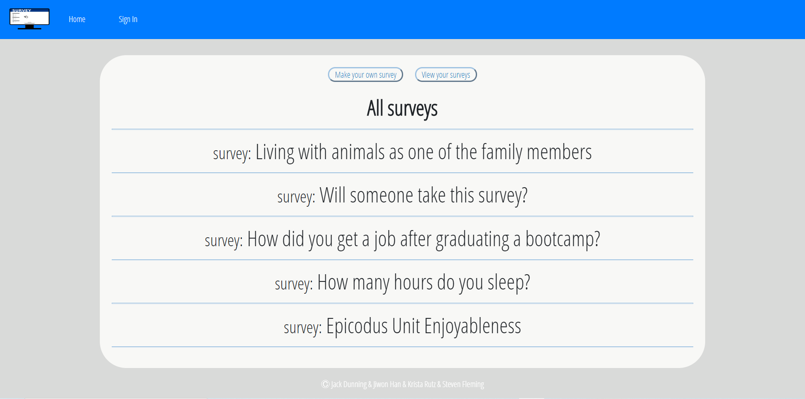
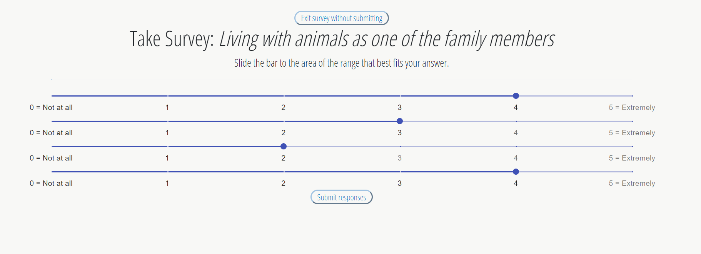
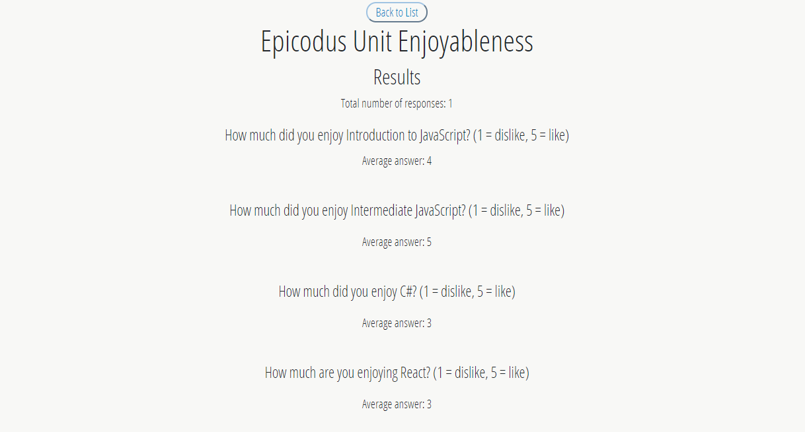
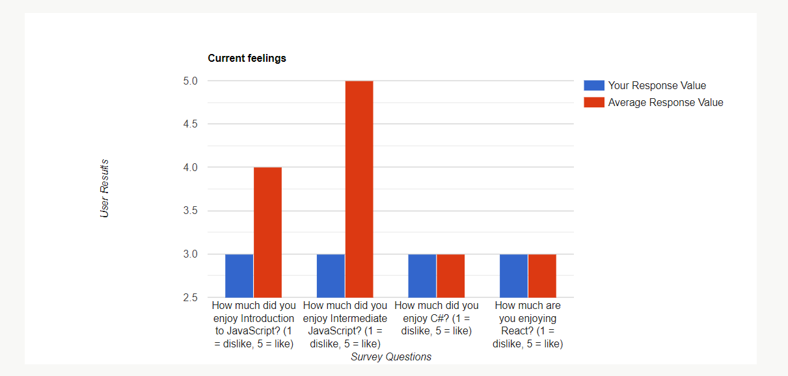

# Survey site :black_nib:

#### An application that allows a user to complete a quiz or survey. 5.5.2020

#### By Jack Dunning, Krista Rutz, Steven Fleming and Jiwon Han

[](https://www.repostatus.org/#wip)
](https://lbesson.mit-license.org/)


## 1. User Flow

This is a survey site that user is able to create new surveys while other users should have the ability to fill out those surveys. This provides full CRUD functioanlities and authentication.

1. A user is able to create, update and delete a survey. All surveys should be stored in the database.
2. A user is able to fill out and submit surveys. 
3. Survey results are submitted to the database. 
4. A user is able to sign up, sign in, and sign out.
5. A user has their own dashboard which lists the surveys they've created.
6. A user is able to see the combined data on a survey in their dashboard. For instance, if a survey provides a 1-5 rating, return an average rating for all surveys.
7. A user is able to take a survey and select their answers on slider bar.
8. A user is able to view survey responses based on firestore data : total number of reponses, average answer. Result page also provide a gragh that visualizes data.

### Parking lot 
1. User can choose from multiple different form types
2. Display indicates whether a user has already taken a survey
3. UI
4. Shows different types of data from surveys, so maybe median value or standard deviations from the mean etc.

### Diagram


### Database

```bash 
|-- responses
|   |-- r1
|   |-- r2
|   |-- r3
|   |-- r4
|   |-- surveyId
|   |-- timeSubmitted
|-- surveys :
|   |-- q1
|   |-- q2
|   |-- q3
|   |-- q4
|   |-- timeSubmitted
|   |-- title
```

### Sreenshot

1. Main Page


2. Create Page


3. Survey Page 


4. Survey Result Page


5. Survey Result Page


### What's Included

```bash 
|-- _tests_ 
|-- actions 
|-- components :
|   |-- App.jsx
|   |   |-- Header/SurveryControl/Footer
|   |-- App.css
|   |-- CreateSurveryForm.js
|   |-- EditSurveryFrom.js
|   |-- Footer.js
|   |-- Header.js
|   |-- MySurvey.js
|   |-- SignInForm.js
|   |-- SignOutButton.js
|   |-- SurveyCard.js
|   |-- Survey.css
|   |-- Survey.js
|   |-- Survey.css
|   |-- SurveyCard.js
|   |-- SurveyChart.js
|   |-- SurveyList.js
|   |-- SurveyResult.js
|-- reducers :
|   |   |-- index.js
|-- firebase.js
|-- history.js
|-- index.jsx
```

**All components were described with propTypes**

## 2. Development

### Tech stack:

+ [NPM](https://www.npmjs.com/) for package management
+ [react](https://reactjs.org/), [react-redux](https://react-redux.js.org/) as core stack
+ [Firebase](https://firebase.google.com/)
+ [Firestore](https://firebase.google.com/docs/firestore)
+ [google slides](https://google.com/slides/about/) for diagram
+ [favicon](https://www.favicon-generator.org/) 

### To run dev mode locally:

```bash
  $ git clone https://github.com/jiwon-seattle/Survey-react-redux-firebase.git
  $ cd into repository
  $ npm install  
  # After successfull pkg installtion
  $ npm start
```
Now, it will automatically open http://localhost:3000 and show you survey site.

### Packages used

`react` `react-redux` `react-bootstrap` `react-dom` `react-router-dom` `react-scripts` `redux` `firebase` `react-google-charts` `react-redux-firebase` `redux-firestore`  

## 3. Known Bugs

There are no known bug at this moment

## 4. Support and contact details

Any feedback is appreciated! Please contact at email: jiwon1.han@gmail.com, JackStunning9001@gmail.com, rutzkri000@gmail.com or 12flemings@gmail.com

### License

*This software is licensed under the MIT license*

Copyright (c) 2020 **_Jack Dunning, Krista Rutz, Steven Fleming and Jiwon Han_**


